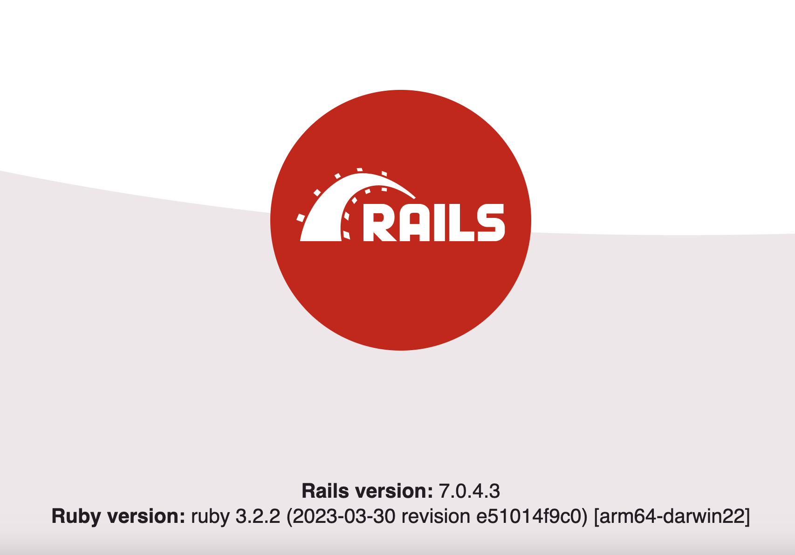

This README would normally document whatever steps are necessary to get the
application up and running.

Things you may want to cover:

* Ruby version: 3.2.2

* Rails version: 7.0.4.3

* Configuration

* Database: Postgres

* Services: RabbitMQ


# Building the containers

```
docker-compose up --build
```

# Creating the databases

```
docker exec ruby-on-rails-repository-pattern-web-1 rails db:create 
```